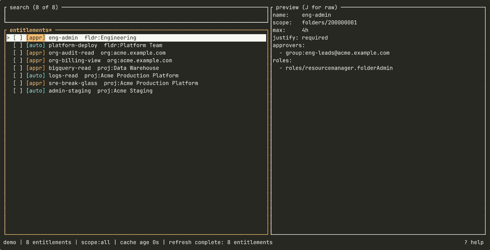

# gpam

[](https://github.com/michalskalski/gpam/actions/workflows/ci.yml)
[](https://crates.io/crates/gpam)

Terminal UI for [Google Cloud Privileged Access Manager](https://docs.cloud.google.com/iam/docs/pam-overview). Browse the entitlements you can request, submit grants with duration + justification, and watch them transition to Active.



## Install

Homebrew (macOS and Linux):

```
brew install michalskalski/gpam/gpam
```

From crates.io:

```
cargo install gpam
```

Pre-built binaries for Linux and macOS are available on the
[GitHub releases page](https://github.com/michalskalski/gpam/releases).

## Quick start

Application Default Credentials must be available for non-demo runs:

```
gcloud auth application-default login
```


```
Usage: gpam [OPTIONS] [COMMAND]

Commands:
  send     Forward a pending grant to a running gpam TUI via its local socket
  approve  Open a one-shot approve modal in this terminal for a known grant

Options:
      --demo         Run with seeded fixtures instead of talking to GCP
      --no-projects  Skip project-scope entitlement discovery
      --no-folders   Skip folder-scope entitlement discovery
      --no-orgs      Skip organization-scope entitlement discovery
  -h, --help         Print help
  -V, --version      Print version
```

## Access model

1. The Cloud Resource Manager API (`cloudresourcemanager.googleapis.com`) must be enabled in your ADC quota project, which is what backs the project/folder/org enumeration. Set it with `gcloud auth application-default set-quota-project <PROJECT>`.
2. Resource visibility (IAM-side): gpam enumerates the projects, folders, and organizations you can see and searches each for entitlements. That enumeration uses `resourcemanager.projects.get`, `resourcemanager.folders.get`, and `resourcemanager.organizations.get`. The standard way to grant these at the right scope is the Browser role (`roles/browser`). You can skip a scope tier with `--no-projects`, `--no-folders`, or `--no-orgs` if you don't have visibility there. Polling grant state uses `privilegedaccessmanager.grants.get` provided by `roles/privilegedaccessmanager.viewer`.
3. Eligibility (PAM-side): to see and request an entitlement, you must be listed as a requester on it (directly or via a group).

## Approving grants

PAM's `SearchGrants` API requires a `parent` entitlement, so finding the grants a user can approve means fanning out one call per entitlement on every poll. That makes per-user discovery impractical past a few dozen entitlements.

gpam therefore doesn't try to discover approvals on its own. Event delivery sits outside the tool. Any producer that writes a line to the local socket (a Pub/Sub bridge, webhook receiver, email-link handler, etc.) acts as the source. Once an event lands, gpam queues it and presents a TUI for review.

The running TUI binds `~/Library/Caches/gpam/gpam.sock` (macOS) / `~/.cache/gpam/gpam.sock` (Linux), and accepts JSON Lines:

```
{"name":"organizations/000/locations/global/entitlements/foo/grants/<uuid>","source":"source-name"}
```

`name` is required and must be a fully-qualified grant resource name (`organizations|folders|projects/<id>/locations/<loc>/entitlements/<ent>/grants/<id>`). `source` is optional metadata.

Two CLI subcommands intended for use by producers:

```
gpam send <name> [--source <tag>]   # forward into the running TUI (non-zero if no listener)
gpam approve <name>                 # one-shot modal in this terminal — no socket
```

Together they can compose a clean fallback: `gpam send "$NAME" || gpam approve "$NAME"`.

## Cache

Per-account SQLite at `~/Library/Caches/gpam/<account>.db` (macOS) or `~/.cache/gpam/<account>.db` (Linux). Soft freshness 30 m (background refresh), hard 24 h (block on refresh).

## License

Licensed under either of [MIT](LICENSE-MIT) or [Apache-2.0](LICENSE-APACHE) at your option.
